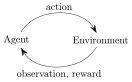

# Observations

The environment’s **step** function returns exactly what we need. In fact, **step** returns four values. These are:

* **observation** \(object\): an environment-specific object representing your _**observation of the environment. For example, pixel data from a camera, joint angles and joint velocities of a robot, or the board state in a board game.**_
* **reward** \(float\): amount of reward achieved by the previous action. The scale varies between environments, but the goal is always to increase your total reward.
* **done** \(boolean\): whether it’s time to `reset` the environment again. Most \(but not all\) tasks are divided up into well-defined episodes, and _**`done` being `True` indicates the episode has terminated.**_ \(For example, perhaps the pole tipped too far, or you lost your last life.\)
* **info** \(dict\): diagnostic information useful for debugging. It can sometimes be useful for learning \(for example, it might contain the raw probabilities behind the environment’s last state change\). However, official evaluations of your agent are not allowed to use this for learning. 

An implementation of the classic “agent-environment loop”. Each timestep, the agent chooses an `action`, and the environment returns an `observation` and a `reward`.





```python
import gym
env = gym.make("CartPole-v1")
observation = env.reset()
for _ in range(1000):
  env.render()
  action = env.action_space.sample() # your agent here (this takes random actions)
  observation, reward, done, info = env.step(action)

  if done:
    observation
```



The process gets started by calling `reset()`, which returns an initial `observation`. So a more proper way of writing the previous code would be to respect the `done` flag:



```python
import gym
env = gym.make('CartPole-v0')
for i_episode in range(20):
    observation = env.reset() #重新初始化，生成observation(包括state等)
    for t in range(100):
        env.render()
        print(observation)
        action = env.action_space.sample()
        observation, reward, done, info = env.step(action)
        if done:
            print("Episode finished after {} timesteps".format(t+1))
            break
env.close()
```





```python
[-0.061586   -0.75893141  0.05793238  1.15547541]
[-0.07676463 -0.95475889  0.08104189  1.46574644]
[-0.0958598  -1.15077434  0.11035682  1.78260485]
[-0.11887529 -0.95705275  0.14600892  1.5261692 ]
[-0.13801635 -0.7639636   0.1765323   1.28239155]
[-0.15329562 -0.57147373  0.20218013  1.04977545]
Episode finished after 14 timesteps
[-0.02786724  0.00361763 -0.03938967 -0.01611184]
[-0.02779488 -0.19091794 -0.03971191  0.26388759]
[-0.03161324  0.00474768 -0.03443415 -0.04105167]
```



[Experiment Video](http://s3-us-west-2.amazonaws.com/rl-gym-doc/cartpole-yes-reset.mp4)

> **However, good general-purpose agents don't need to know the semantics of the observations: they can learn how to map observations to actions to maximize reward without any prior knowledge.**

